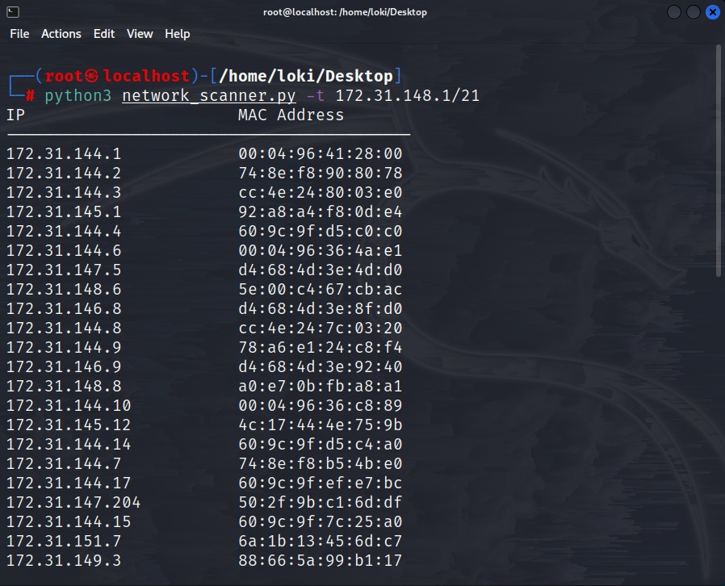

## Network Scanner 🌐

Network Scanner is a simple ARP scanner which can be used to scan for live hosts in a network. It basically returns the MAC address and IP address of the devices of the same network. It can scan for multiple subnets also. It simply produces the output in a List format. This can be used in the first phases of a pentest where you have access to a network.


## Usage 🚀
#### Clone the github repository and change the directory
```bash
https://github.com/okieLoki/Network-Scanner
cd Network-Scanner
```
#### Run python3 to executive the file
```bash
python3 network_scanner.py -t (target ip)
```
```bash
python3 network_scanner.py --target (target ip)
```

You can also scan subnets using the same command.
To know more about subnets visit this [link](https://www.freecodecamp.org/news/subnet-cheat-sheet-24-subnet-mask-30-26-27-29-and-other-ip-address-cidr-network-references/)
#### To get help about the commands use the help command
```bash
python3 network_scanner.py -h
```
```bash
python3 network_scanner.py -help
```

## Screenshots 📸




## Python Libraries used 📚

- scapy
- optscanner

